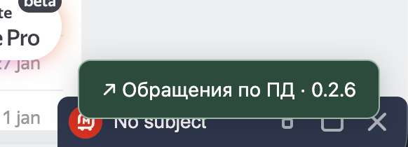
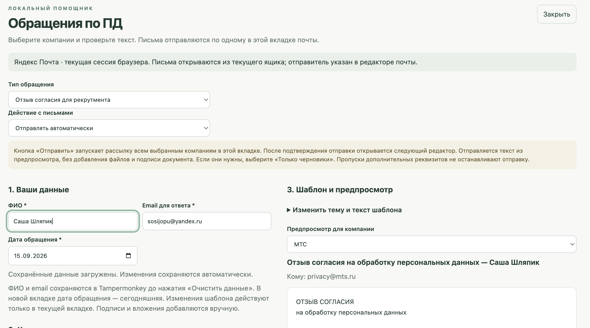
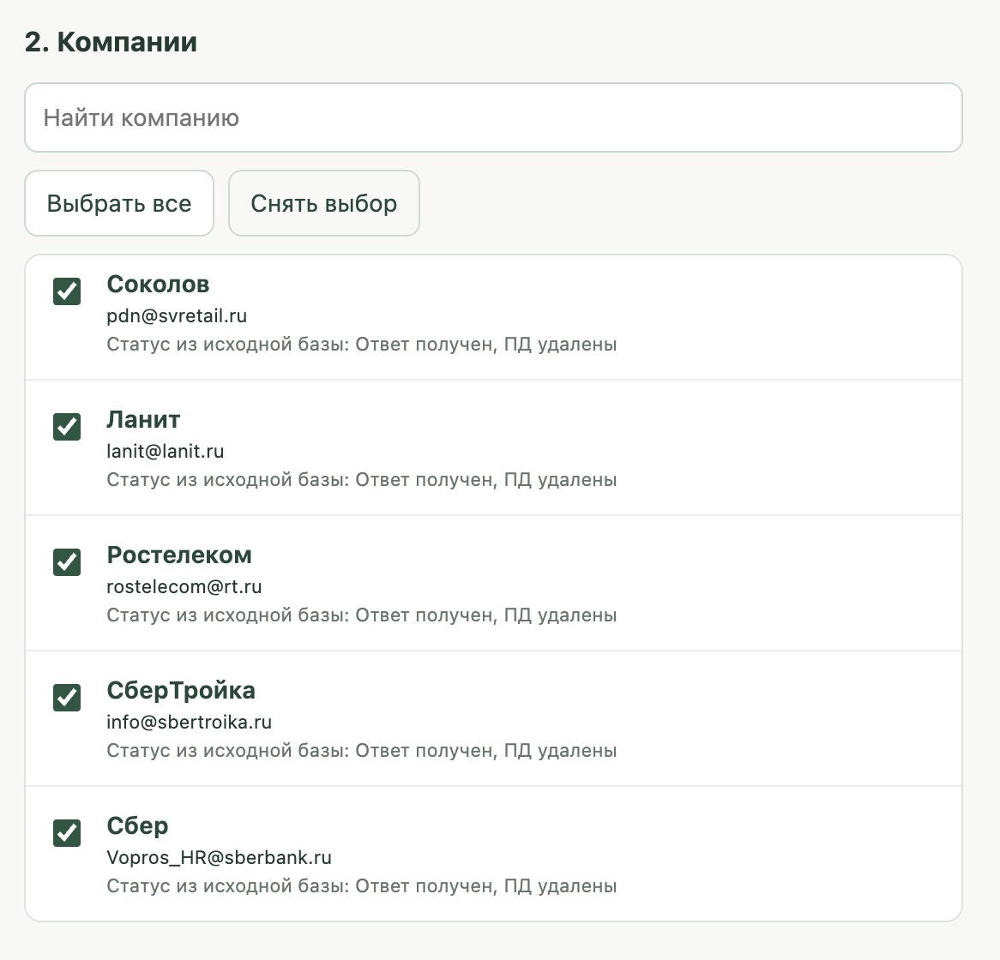
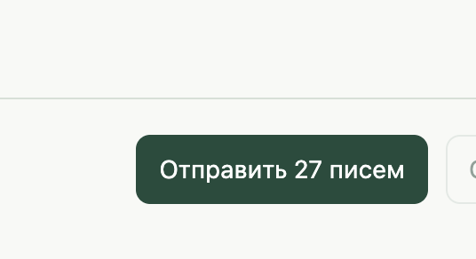

# Скрипт для массового отзыва персональных данных

## Проверено на яндекс почте, на гугле не проверял

## Установка Tampermonkey в Chrome — 3 шага

### 1. Установите расширение

Откройте [Tampermonkey в Интернет-магазине Chrome](https://chromewebstore.google.com/detail/tampermonkey/dhdgffkkebhmkfjojejmpbldmpobfkfo?hl=ru) на компьютере. Нажмите **«Установить» → «Установить расширение»**.

На скриншоте расширение уже установлено, поэтому кнопка называется **«Удалить из Chrome»**. Если у вас так же — переходите к шагу 2, удалять ничего не нужно.

### 2. Откройте Manage extension

Нажмите **пазл «Расширения»** справа вверху Chrome → **три точки рядом с Tampermonkey** → **Manage extension** («Управление расширением»).

### 3. Включите Allow user scripts

Прокрутите настройки до **Allow user scripts** («Разрешить пользовательские скрипты») и включите переключатель справа. Он должен стать **синим**, как на скриншоте. Если уже синий — оставьте включённым.

## Добавьте скрипт

**Сначала скопируйте код:** откройте [текст скрипта по этой ссылке](https://raw.githubusercontent.com/LevMaltcev6/reject_pd/main/dist/return-pd.user.js) в новой вкладке. Нажмите внутри текста, затем **Ctrl + A** (выделить всё) и **Ctrl + C** (скопировать). На Mac — **⌘ + A** и **⌘ + C**. Скачивать отдельный файл не нужно.

Если по ссылке Tampermonkey сразу открыл окно установки, нажмите в нём **Install / «Установить»** и переходите к разделу «Запуск».

### 1. Нажмите Options

В Chrome откройте **пазл «Расширения» → три точки рядом с Tampermonkey → Options**.

### 2. Нажмите плюсик

В открывшейся панели Tampermonkey нажмите **маленький плюс в квадрате**, слева от вкладки **Installed Userscripts**. Откроется окно нового скрипта.

Если этот скрипт уже установлен, нажмите на его название в списке и замените код в нём — второй экземпляр создавать не нужно.

### 3. Вставьте код в окно

Нажмите **внутри тёмного окна с кодом**. Нажмите **Ctrl + A**, затем **Ctrl + V**: весь пример кода заменится текстом, который вы скопировали по ссылке выше. На Mac — **⌘ + A**, затем **⌘ + V**.

### 4. Нажмите File → Save

В меню над кодом нажмите **File**, затем **Save**. Скрипт сохранён — теперь можно открыть почту.

## Запуск

Откройте [Яндекс Почту](https://mail.yandex.ru/) и перезагрузите страницу после установки скрипта.

### 1. Нажмите «Обращения по ПД» в правом нижнем углу

### 2. Впишите ФИО и почту для ответа

В поле **«ФИО»** укажите свои фамилию, имя и отчество. В поле **«Email для ответа»** — адрес, на который хотите получить ответ компании.

### 3. Выберите компании

Прокрутите до раздела **«Компании»** и отметьте нужные галочками. Чтобы отметить весь список, нажмите **«Выбрать все»**.

### 4. Запустите скрипт

Проверьте текст обращения в предпросмотре. В поле **«Действие с письмами»** должно быть выбрано **«Отправлять автоматически»**. Нажмите **«Отправить N писем»** — число зависит от количества выбранных компаний.

Оставьте вкладку почты открытой до завершения отправки. Для остановки нажмите **«Остановить»**.

Если Яндекс вернёт ошибку отправки, скрипт покажет её причину и код в статусе и карточке письма. Очередь остановится; автоматического повтора не будет.

При ошибке `failed to auth sender` скрипт также покажет адрес и тип отправителя из запроса Яндекса, если удалось их прочитать. Это данные поля «От кого»; email для ответа из анкеты добавляется только в текст письма.
