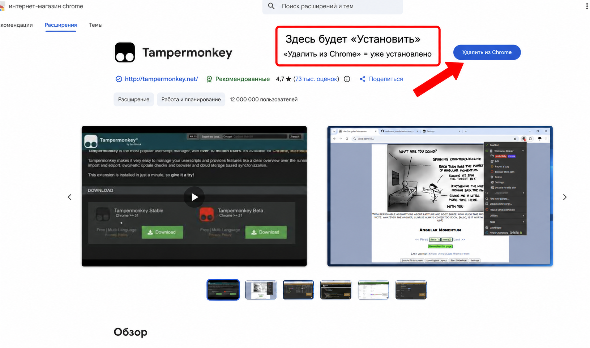
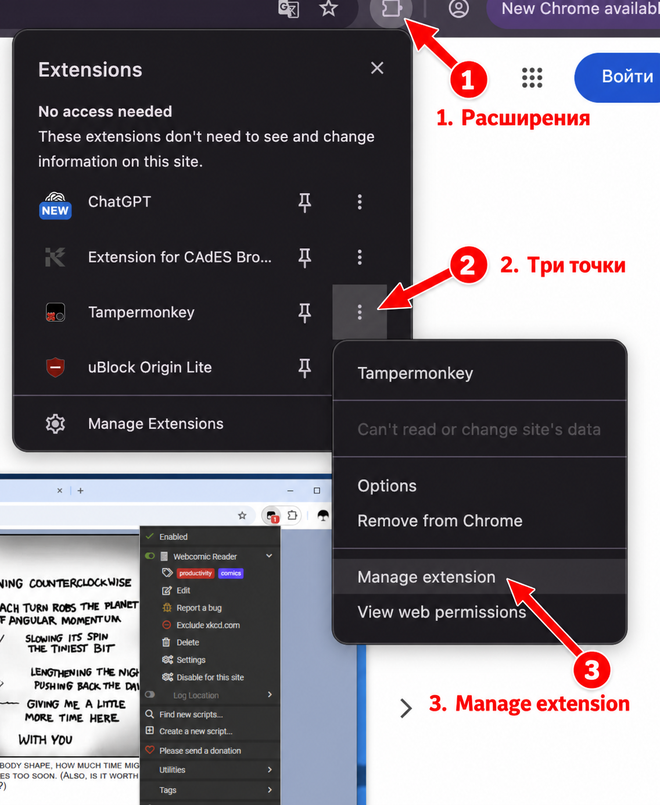
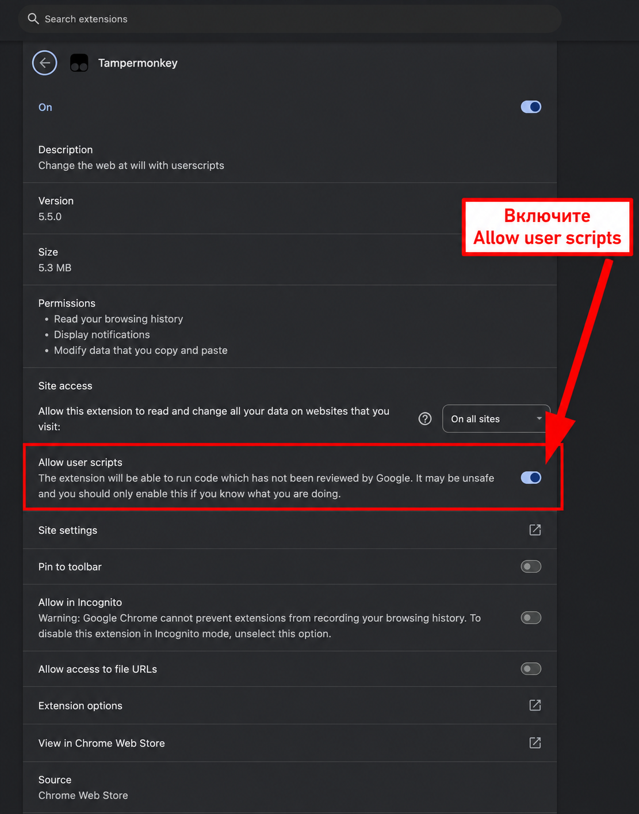
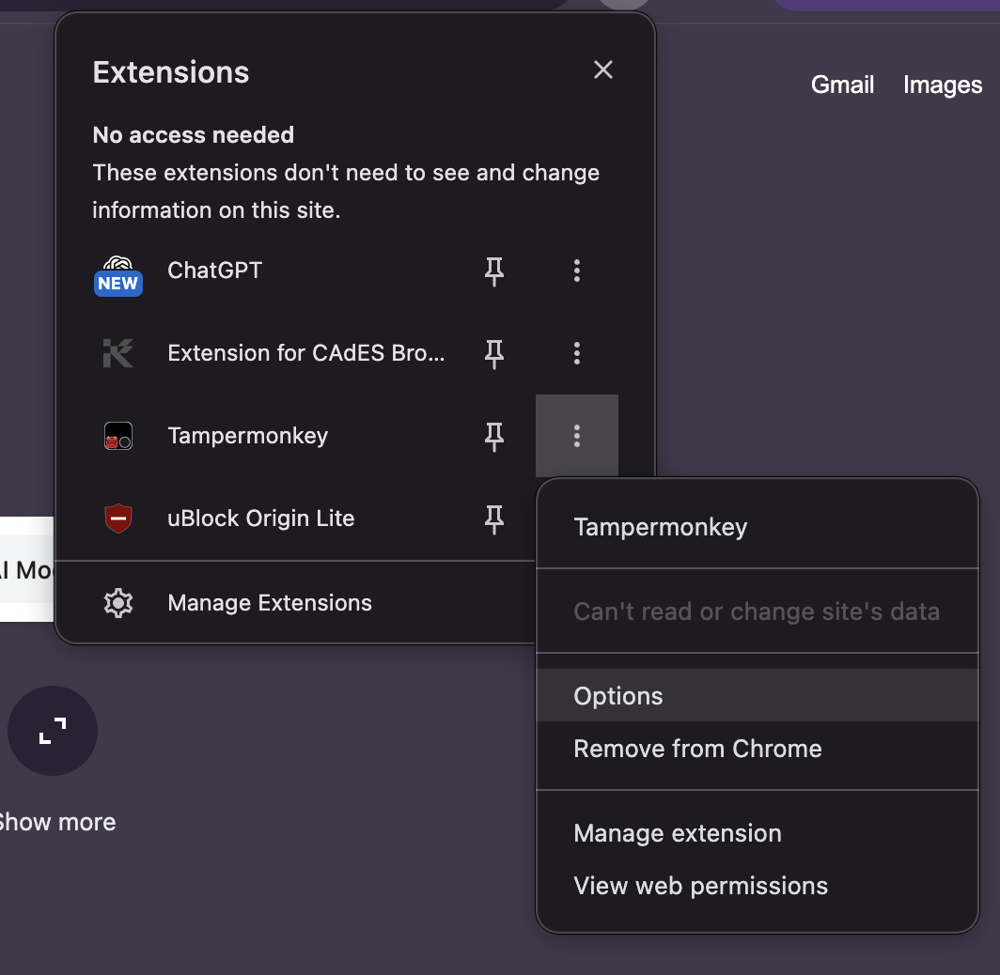
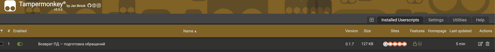
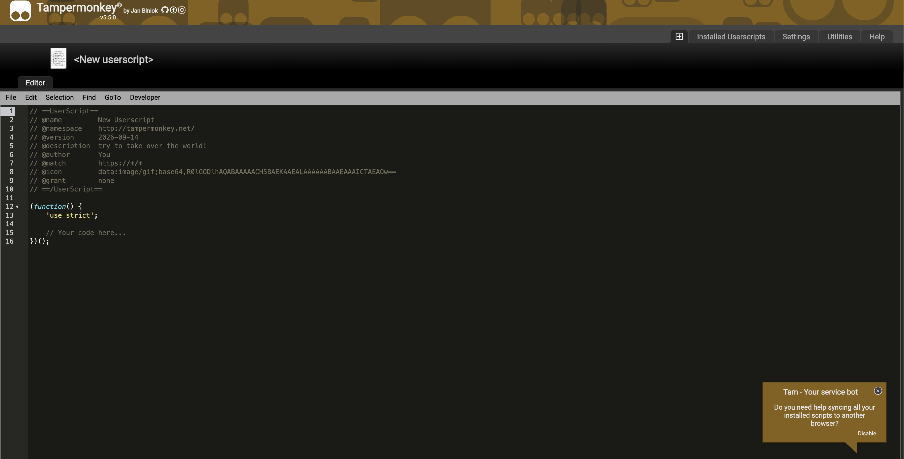
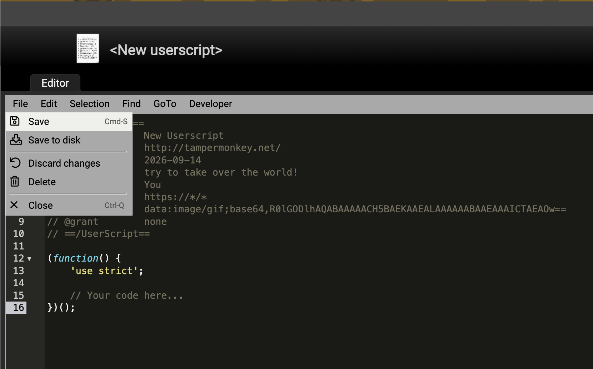

# Скрипт для массового отзыва персональных данных

## Проверено на яндекс почте, на гугле не проверял

## Установка Tampermonkey в Chrome — 3 шага

### 1. Установите расширение

Откройте [Tampermonkey в Интернет-магазине Chrome](https://chromewebstore.google.com/detail/tampermonkey/dhdgffkkebhmkfjojejmpbldmpobfkfo?hl=ru) на компьютере. Нажмите **«Установить» → «Установить расширение»**.

На скриншоте расширение уже установлено, поэтому кнопка называется **«Удалить из Chrome»**. Если у вас так же — переходите к шагу 2, удалять ничего не нужно.

### 2. Откройте Manage extension

Нажмите **пазл «Расширения»** справа вверху Chrome → **три точки рядом с Tampermonkey** → **Manage extension** («Управление расширением»).

### 3. Включите Allow user scripts

Прокрутите настройки до **Allow user scripts** («Разрешить пользовательские скрипты») и включите переключатель справа. Он должен стать **синим**, как на скриншоте. Если уже синий — оставьте включённым.

## Добавьте скрипт

**Сначала скопируйте код:** откройте [текст скрипта по этой ссылке](https://raw.githubusercontent.com/LevMaltcev6/reject_pd/main/dist/return-pd.user.js) в новой вкладке. Нажмите внутри текста, затем **Ctrl + A** (выделить всё) и **Ctrl + C** (скопировать). На Mac — **⌘ + A** и **⌘ + C**. Скачивать отдельный файл не нужно.

Если по ссылке Tampermonkey сразу открыл окно установки, нажмите в нём **Install / «Установить»** и переходите к разделу «Запустите в почте».

### 1. Нажмите Options

В Chrome откройте **пазл «Расширения» → три точки рядом с Tampermonkey → Options**.

### 2. Нажмите плюсик

В открывшейся панели Tampermonkey нажмите **маленький плюс в квадрате**, слева от вкладки **Installed Userscripts**. Откроется окно нового скрипта.

Если этот скрипт уже установлен, нажмите на его название в списке и замените код в нём — второй экземпляр создавать не нужно.

### 3. Вставьте код в окно

Нажмите **внутри тёмного окна с кодом**. Нажмите **Ctrl + A**, затем **Ctrl + V**: весь пример кода заменится текстом, который вы скопировали по ссылке выше. На Mac — **⌘ + A**, затем **⌘ + V**.

### 4. Нажмите File → Save

В меню над кодом нажмите **File**, затем **Save**. Скрипт сохранён — теперь можно открыть почту.

## Запустите в почте

1. Откройте [Яндекс Почту](https://mail.yandex.ru/) и войдите в нужный почтовый ящик.
2. Перезагрузите страницу: **Ctrl + R**, на Mac — **⌘ + R**.
3. Нажмите **«Обращения по ПД · 0.2.6»** справа внизу.
4. Выберите шаблон обращения, заполните ФИО и email для ответа.
5. Выберите компании и проверьте получателей и текст в предпросмотре.
6. Выберите **«Отправлять автоматически»** и нажмите **«Отправить N писем»**.
7. Оставьте вкладку открытой до завершения очереди. Для остановки нажмите **«Остановить»**.

Чтобы подготовить письма без автоматической отправки, выберите **«Только черновики»** и нажмите **«Подготовить N черновиков»**. После подготовки каждого письма отправьте его вручную или закройте редактор с сохранением черновика, затем нажмите **«Продолжить очередь»** в панели скрипта.

**Если кнопка скрипта не появилась:** проверьте, что Tampermonkey включён на странице `chrome://extensions`, Allow user scripts из шага 3 включено, а сам скрипт включён в панели управления Tampermonkey. Затем снова перезагрузите почту.
